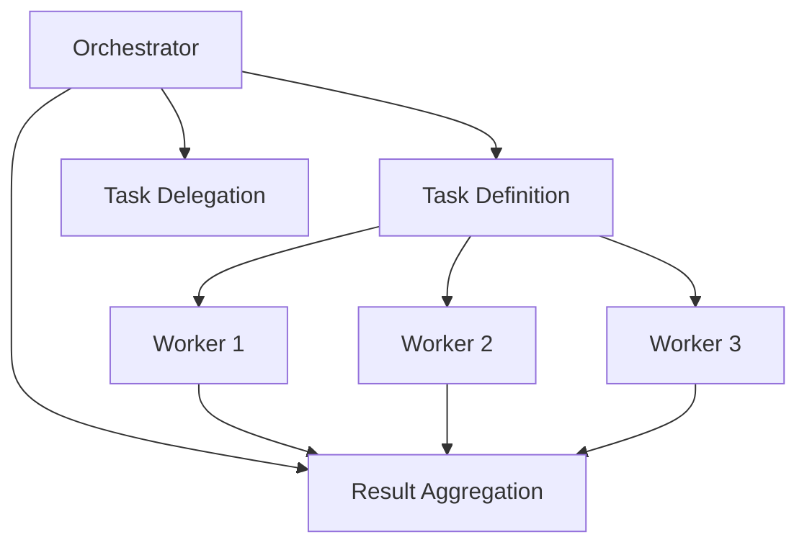

Building effective systems with Large Language Models (LLMs) requires careful consideration of architecture and control flow. As I've discovered through extensive experimentation, there are two primary approaches to implementing LLM systems: structured workflows and autonomous agents. Each has distinct advantages and use cases that I'll explore in this post.

### TL;DR

- **Workflows** are predictable, controlled pipelines of LLM components with well-defined stages.
- **Autonomous agents** use LLMs with tools to operate independently until success or resource exhaustion.
- **Start with workflows** for most applications — they're more predictable and easier to reason about.
- **Use agents sparingly** — only when tasks have uncertain paths but clear success validation.

### Two Approaches to LLM Architecture

When designing LLM-powered systems, we essentially have two architectural patterns to choose from:

#### 1. LLM-Driven Workflows

In workflow architectures, LLM components are connected in a pipeline with explicit control flow managed by application code. The system orchestrates the movement of data between components, with each LLM handling a specific, well-defined responsibility.

Key characteristics:
- **Predictable execution paths** — we control exactly how data flows through the system
- **Clear separation of concerns** — each LLM component has a focused responsibility
- **Easier to debug** — discrete steps can be traced and validated independently
- **More efficient** — we only run the necessary components for each request

#### 2. Autonomous Agents

Agents are LLMs given access to tools (functions they can call) and an environment that provides feedback. We define a success condition or maximum attempt limit, and the agent operates autonomously until one of those conditions is met.

Key characteristics:
- **Self-directed problem solving** — the agent determines its own path to the solution
- **Tool-using capability** — agents interact with external systems through defined tools
- **Dynamic execution paths** — the sequence of actions isn't predetermined
- **Potentially higher resource usage** — agents may make multiple attempts before succeeding

### My General Rule: Start With Workflows

I've found that **workflows should be the default choice** for most LLM applications. They provide predictability, control, and efficiency. Only when a task meets very specific criteria do I consider an autonomous agent approach.

I implement autonomous agents only when:
1. The task is too complex to enumerate all possible steps in advance
2. We can clearly validate success through environmental feedback
3. The potentially increased resource usage is acceptable

### Case Study: Playwright Debug Agent

One of my recent projects involved building a system to analyze and diagnose Playwright test failures. This provides a perfect example of these architectural choices in action.

#### The Workflow Approach

My first implementation used a linear workflow with several specialized agents:

1. **TraceAnalysisAgent** — analyzes the Playwright trace data to identify key events and patterns
2. **ContextAgent** — retrieves relevant documentation using vector embeddings and RAG techniques
3. **DiagnosisAgent** — determines the likely cause of the failure based on trace analysis and context
4. **RecommendationAgent** — provides actionable recommendations to fix the issue

Each agent produces structured output validated with Zod schemas, and results feed into a central state that grows richer as the pipeline progresses. This approach satisfied our core requirements with predictable behavior and clear separation of concerns.

#### Considering an Agent Approach

While the workflow solution worked well, I contemplated whether an autonomous agent would be appropriate for actually fixing broken tests. This would involve:

1. Analyzing the test failure
2. Determining what needs to be fixed
3. Making changes to the test code
4. Running the test to validate the fix
5. Iterating if needed

This scenario fits the criteria for autonomous agents because:
- The exact steps needed to fix a test depend on the specific failure
- We can validate success by running the test and checking if it passes
- The potential need for multiple iterations makes a workflow less practical

However, since we didn't have access to the test code (test.spec.ts) in this project, we couldn't implement the validation step, making an autonomous agent less appropriate.

#### The Hybrid Approach

I also experimented with an orchestrator-worker pattern that combines elements of both approaches:

In this model, an orchestrator LLM:
1. Defines tasks and their dependencies
2. Delegates specific tasks to worker LLMs
3. Aggregates results and determines next steps

This approach allows for more dynamic workflows while maintaining more control than a fully autonomous agent. While it was more complex than necessary for our use case (as you pointed out), it provided valuable insights into how LLMs could potentially manage their own workflows.

### Lessons Learned

Through these experiments, I've developed some principles for choosing between workflows and agents:

1. **Default to workflows** for most applications
2. **Use controlled, linear pipelines** when the stages are clear and sequential
3. **Consider orchestrator-worker patterns** for complex but structured tasks
4. **Reserve autonomous agents** for situations where the path is uncertain but success is verifiable

Perhaps most importantly, I've learned to avoid overengineering. The simplest architecture that meets requirements is almost always the best choice, and it's often simpler than we initially think.

### Conclusion

When building LLM systems, the choice between workflows and agents isn't binary — it's a spectrum of control versus autonomy. Understanding this spectrum helps us make more informed architectural decisions.

I now approach every new LLM project with the question: "What's the simplest architecture that will satisfy our requirements?" More often than not, the answer involves a well-structured workflow rather than a fully autonomous agent.

What architectural patterns have you found effective in your LLM projects? I'd love to hear about your experiences and approaches.
