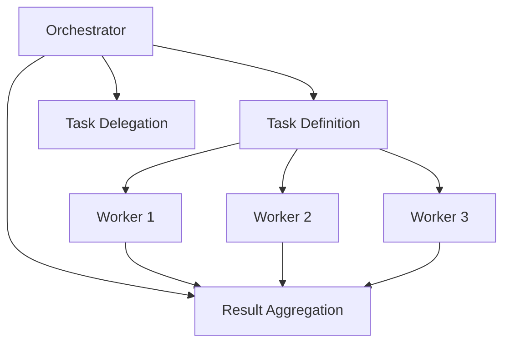

Building effective systems with Large Language Models (LLMs) requires careful consideration of architecture and control flow. As I've discovered through extensive experimentation, there are two primary approaches to implementing LLM systems: structured workflows and autonomous agents. Each has distinct advantages and use cases that I'll explore in this post.

### TL;DR

Workflows are predictable, controlled pipelines of LLM components with well‑defined stages. Autonomous agents, by contrast, use tools to operate independently until they either succeed or run out of budget. For most applications it’s better to start with workflows because they’re easier to reason about, and then reach for agents only when the path is uncertain but success can be validated cleanly.

### Two Approaches to LLM Architecture

When designing LLM-powered systems, we essentially have two architectural patterns to choose from:

#### 1. LLM-Driven Workflows

In workflow architectures, LLM components are connected in a pipeline with explicit control flow managed by application code. The system orchestrates the movement of data between components, with each LLM handling a specific, well-defined responsibility.

Key characteristics include predictable execution paths—we control how data flows—clear separation of concerns so each component has a focused job, simpler debugging because steps can be traced in isolation, and better efficiency since only the needed components run for a given request.

#### 2. Autonomous Agents

Agents are LLMs given access to tools (functions they can call) and an environment that provides feedback. We define a success condition or maximum attempt limit, and the agent operates autonomously until one of those conditions is met.

These systems solve problems more autonomously: they decide their own path, use tools to interact with other systems, and follow dynamic execution paths rather than a single predetermined sequence. The tradeoff is higher and less predictable resource usage because multiple attempts may be needed before they converge.

### My General Rule: Start With Workflows

I've found that workflows should be the default choice for most LLM applications. They provide predictability, control, and efficiency. Only when a task meets very specific criteria do I consider an autonomous agent approach.

I implement autonomous agents only when the task is too complex to enumerate steps in advance, when success can be validated through clear environmental feedback, and when the potential increase in resource usage is acceptable.

### Case Study: Playwright Debug Agent

One of my recent projects involved building a system to analyze and diagnose Playwright test failures. This provides a perfect example of these architectural choices in action.

#### The Workflow Approach

My first implementation used a linear workflow with several specialized agents:

1. **TraceAnalysisAgent** — analyzes the Playwright trace data to identify key events and patterns
2. **ContextAgent** — retrieves relevant documentation using vector embeddings and RAG techniques
3. **DiagnosisAgent** — determines the likely cause of the failure based on trace analysis and context
4. **RecommendationAgent** — provides actionable recommendations to fix the issue

Each agent produces structured output validated with Zod schemas, and results feed into a central state that grows richer as the pipeline progresses. This approach satisfied our core requirements with predictable behavior and clear separation of concerns.

#### Considering an Agent Approach

While the workflow solution worked well, I contemplated whether an autonomous agent would be appropriate for actually fixing broken tests. This would involve:

1. Analyzing the test failure
2. Determining what needs to be fixed
3. Making changes to the test code
4. Running the test to validate the fix
5. Iterating if needed

This scenario fits the criteria for autonomous agents because the exact steps depend on the particular failure, success can be validated by re‑running the test, and the number of iterations is uncertain enough that a linear workflow becomes awkward.

However, since we didn't have access to the test code (test.spec.ts) in this project, we couldn't implement the validation step, making an autonomous agent less appropriate.

#### The Hybrid Approach

I also experimented with an orchestrator-worker pattern that combines elements of both approaches:

In this model, an orchestrator LLM:
1. Defines tasks and their dependencies
2. Delegates specific tasks to worker LLMs
3. Aggregates results and determines next steps

This approach allows for more dynamic workflows while retaining more control than a fully autonomous agent. It was more complex than necessary for our case, but it offered useful insight into how LLMs might manage their own workflows.

### Lessons Learned

A few principles have held up across projects. Default to workflows for most applications. Use controlled, linear pipelines when the stages are clear and sequential. Consider an orchestrator‑worker pattern for complex yet still structured tasks. Reserve autonomous agents for situations where the path is uncertain but the success condition is objective and verifiable.

Perhaps most importantly, I've learned to avoid overengineering. The simplest architecture that meets requirements is almost always the best choice, and it's often simpler than we initially think.

### Conclusion

When building LLM systems, the choice between workflows and agents isn't binary — it's a spectrum of control versus autonomy. Understanding this spectrum helps us make more informed architectural decisions.

I now approach every new LLM project with the question: "What's the simplest architecture that will satisfy our requirements?" More often than not, the answer involves a well-structured workflow rather than a fully autonomous agent.

What architectural patterns have you found effective in your LLM projects? I'd love to hear about your experiences and approaches.
