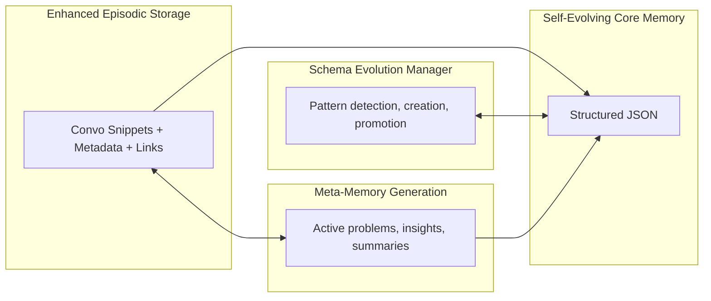

If you’ve ever tried to remember “that one thing someone said three Tuesdays ago at 4:13pm,” you’ve felt the pain of flat, unstructured memory. Traditional summarization-based memory systems are like stuffing your life into a single sock drawer: eventually you can’t find anything, socks contradict each other, and once you compress it, good luck uncompressing it without losing a few.

This post is a deep dive into a different approach we built: a Self‑Evolving Hybrid Layered Structured Memory System. Think of it as a living, versioned, schema-aware, contradiction‑resistant memory that grows with the user—without devolving into semantic soup or rigid schemas that fossilize on day one. Also, yes, we use JSON Patches like surgical tools instead of sledgehammers.

### TL;DR

- **Flat text memories are brittle.** Summaries lose signal; updates cause unintended edits; rollback is a nightmare.
- **Pure vectors are great for “vibes,”** not always for precision updates.
- **Pure rigid schemas are tidy** but can’t evolve fast enough.
- **We combine structured core memory, episodic records, and a schema evolution manager** so memory can grow safely and stay queryable.
- **Everything is versioned and updated via JSON Patch,** so changes are targeted, auditable, and reversible.

### The Problem We Set Out to Solve

Our previous two‑phase memory (Extract → Summarize → Store flat text) created technical and UX friction:

- Important micro‑facts vanished in summarization.
- No surgical updates; any change risked touching unrelated text.
- No version history, no rollbacks.
- Contradictions were “summarized away,” not resolved.
- No typed distinctions between facts, preferences, episodes, goals.
- Couldn’t adapt to new info types without manual schema tweaks.
- Retrieval required brittle regex or expensive re‑embedding.

### The Mental Model: Memory as a Living Organism

Users don’t speak in schemas; they speak in episodes. Systems, however, need structure to reason, retrieve, and evolve reliably. Our compromise:

- **Core Memory (structured facts):** Canonical, typed, precise. Updated via JSON Patch.
- **Episodic Storage (contextual snippets):** Preserves the words, tone, time, and topic links.
- **Schema Evolution (gardener):** Detects patterns, proposes/creates categories, and promotes frequently used dynamics into the core schema.
- **Meta‑Memory (the analyst):** Background processes that generate insights and active problem trackers from the above.

The result is both human‑faithful (we keep episodes!) and machine‑tractable (we structure facts!)—with an upgrade path when new information keeps showing up.

### Architecture (Dessert First)



### Core Memory: Structured, Precise, Patchable

The core is a strongly structured JSON document that captures the user’s durable facts and preferences. It combines a well‑defined schema with a `dynamicCategories` space for emerging information.

```json
{
  "healthProfile": {
    "conditions": [{ "name": "Type 2 Diabetes", "since": "2018-03", "confidence": 0.95 }],
    "other": { "recentA1c": "6.8 as of November 2023" }
  },
  "dietaryProfile": {
    "preferences": { "likes": ["greek yogurt", "berries"], "dislikes": ["kale"] }
  },
  "dynamicCategories": {
    "exerciseRoutine": {
      "description": "User's exercise habits",
      "data": { "preferred_activities": ["walking", "swimming"] }
    }
  },
  "_meta": {
    "version": 7,
    "lastUpdated": "2024-11-30T12:34:56Z",
    "schemaEvolution": []
  }
}
```

Key properties:

- **Targeted updates** via JSON Patch (RFC 6902).
- **Versioned** so we can diff, audit, and roll back.
- **Dynamic** space for uncaptured patterns, without polluting the core prematurely.

#### JSON Patch: Surgical Edits, Not Summaries

Instead of re‑summarizing, we apply precise patches so we don’t accidentally delete unrelated facts.

```json
[
  {
    "op": "add",
    "path": "/dynamicCategories/exerciseRoutine/data/yoga",
    "value": "three times weekly"
  },
  {
    "op": "add",
    "path": "/dynamicCategories/stressManagement",
    "value": {
      "description": "User's stress management techniques",
      "data": { "techniques": ["yoga"] },
      "createdAt": "2023-12-15T10:30:00Z"
    }
  }
]
```

Contradiction example:

```json
{ "op": "replace", "path": "/healthProfile/conditions/0/since", "value": "2019-03" }
```

We record confidence and source alongside the patch metadata in the event log (see Versioning), rather than shoving it into the core doc itself unless you prefer to mirror it in `_meta`.

#### Versioning and Audit Trail

We maintain an append‑only event stream of patches. The current state is the fold of all accepted patches. Rollback = replay without the bad patch(es). Cherry‑pick = replay a subset.

```ts
// TypeScript sketch
type JsonValue = null | boolean | number | string | JsonValue[] | { [k: string]: JsonValue };

export interface JsonPatchOp {
  op: 'add' | 'remove' | 'replace' | 'move' | 'copy' | 'test';
  path: string;
  value?: JsonValue;
  from?: string; // for move/copy
}

export interface MemoryEvent {
  id: string;
  timestamp: string;
  actor: 'system' | 'user' | 'agent';
  source?: string; // e.g., message id, tool name
  confidence?: number;
  rationale?: string;
  patch: JsonPatchOp[];
}

export interface VersionedMemory {
  version: number;
  document: JsonValue;
}

export function applyEvents(base: JsonValue, events: MemoryEvent[]): VersionedMemory {
  // In prod, use a robust RFC6902 lib; this is conceptual
  let doc = structuredClone(base);
  let version = 0;
  for (const ev of events) {
    for (const op of ev.patch) {
      // applyOp(doc, op) — left as an exercise; libraries exist
    }
    version += 1;
  }
  return { version, document: doc };
}
```

Operationally, we store events in an append‑only collection (indexed by `userId, timestamp`) and periodically materialize snapshots for fast reads.

### Enhanced Episodic Storage: Keep the Human Bits

Core memory captures facts; episodes capture the story. We store important snippets with rich metadata and relational links back to the core.

```json
{
  "timestamp": "2023-12-05T18:30:22Z",
  "content": "I tried that dawn phenomenon strategy... It's been working really well!",
  "metadata": {
    "topics": ["dawn phenomenon", "blood glucose", "insulin management", "success story"],
    "sentiment": "positive",
    "importance": 8,
    "relatedPaths": ["/healthProfile/conditions/0"]
  }
}
```

Why it matters:

- **Recall specificity**: “What exactly did we decide last week?”
- **Attribution**: “Who said this and when?”
- **Fact grounding**: Link episodes to core fields they influenced.

#### Retrieval Sketch

```ts
interface Episode {
  timestamp: string;
  content: string;
  metadata: {
    topics: string[];
    sentiment?: 'positive' | 'neutral' | 'negative';
    importance?: number; // 1..10
    relatedPaths?: string[];
  };
}

function scoreEpisode(ep: Episode, queryTopics: string[], relatedPaths?: string[]): number {
  const topicOverlap = ep.metadata.topics.filter((t) => queryTopics.includes(t)).length;
  const pathOverlap =
    relatedPaths?.filter((p) => ep.metadata.relatedPaths?.includes(p)).length ?? 0;
  const importance = ep.metadata.importance ?? 5;
  return topicOverlap * 3 + pathOverlap * 4 + importance;
}

function retrieveEpisodes(
  episodes: Episode[],
  queryTopics: string[],
  relatedPaths?: string[],
  k = 5
): Episode[] {
  return episodes
    .map((ep) => ({ ep, score: scoreEpisode(ep, queryTopics, relatedPaths) }))
    .sort((a, b) => b.score - a.score)
    .slice(0, k)
    .map((x) => x.ep);
}
```

### Active Problem Tracking: Memory That Plans With You

Some user details are not just facts; they’re ongoing quests. We track problems, attempted solutions, and outcomes over time.

```json
{
  "description": "Post-dinner glucose spikes",
  "status": "active",
  "priority": 8,
  "attempts": [
    {
      "date": "2023-11-20",
      "approach": "Walking after dinner",
      "outcome": "20-30 point reduction",
      "successful": true
    },
    {
      "date": "2023-11-25",
      "approach": "Reduced carb portion",
      "outcome": "40-50 point reduction",
      "successful": true
    }
  ]
}
```

This gives the system memory of what worked for this person—so advice gets sharper over time.

### Schema Evolution: From Chaos to Categories (Without Manual Babysitting)

Rigid schemas break; amorphous blobs rot. The evolution manager inspects uncategorized and dynamic data, then promotes patterns to first‑class citizens.

Process:

1. Mine `uncategorized` and `dynamicCategories` for recurring keys/topics.
2. Track usage frequency, recency, and cross‑links.
3. Propose a normalized category when thresholds are met.
4. Migrate existing instances into the new structure.
5. Log the evolution in `_meta.schemaEvolution`.

Before → After:

```json
{
  "uncategorized": {
    "sleep_note_1": "Having trouble staying asleep",
    "sleep_note_2": "Higher BG after poor sleep",
    "sleep_note_3": "Started using sleep mask"
  }
}
```

```json
{
  "sleepHealth": {
    "duration": "6-7 hours",
    "challenges": "Difficulty staying asleep",
    "impact": "Higher morning BG after poor sleep",
    "aids": ["sleep mask"]
  }
}
```

Detection sketch:

```ts
interface EvolutionCandidate {
  key: string;
  occurrences: number;
  relatedTopics: string[];
}

function detectCandidates(doc: any): EvolutionCandidate[] {
  // Walk uncategorized/dynamic, tally recurring structures/terms
  // Return candidates ordered by support
  return [];
}

function promoteCategory(doc: any, candidate: EvolutionCandidate, categoryName: string): any {
  // Create structured destination, migrate instances, update _meta
  return doc;
}
```

### Contradiction Handling: Be Picky, Not Forgetful

Contradictions aren’t failure; they’re progress with context. We:

1. Detect conflicting fields (e.g., diagnosis year).
2. Compare source credibility and confidence.
3. Replace or deprecate the old value via patch.
4. Record the event, rationale, and new confidence.

```json
{
  "op": "replace",
  "path": "/healthProfile/conditions/0/since",
  "value": "2019-03",
  "_event": { "confidence": 0.98, "source": "user_correction" }
}
```

We retain the prior state in the event log for full auditability.

### Migration: From Flat Text to Living Structure

Pipeline for converting legacy summaries into the new model:

1. **Extraction**: Use an LLM to identify entities (conditions, meds, preferences, habits, etc.).
2. **Mapping**: Place high‑confidence items into core fields; others into `dynamicCategories` or `uncategorized` with rationale.
3. **Patch Generation**: Emit JSON Patches rather than wholesale writes.
4. **Human‑in‑the‑Loop (optional)**: Surface low‑confidence diffs for approval.
5. **Episodic Backfill**: Keep original sentences as episodes linked to the fields they influenced.

Example:

Flat:

```text
User has type 2 diabetes, diagnosed in 2018. Takes Metformin. Likes Greek yogurt but dislikes kale. Tries to walk daily.
```

Structured:

```json
{
  "healthProfile": {
    "conditions": [{ "name": "Type 2 Diabetes", "since": "2018" }],
    "medications": [{ "name": "Metformin" }]
  },
  "dietaryProfile": { "preferences": { "likes": ["greek yogurt"], "dislikes": ["kale"] } },
  "dynamicCategories": {
    "exerciseRoutine": { "description": "User's exercise habits", "data": { "walking": "daily" } }
  }
}
```

### Retrieval: Context Packing Without Hallucinating

When answering a question, we retrieve:

- Targeted core fields (via JSON pointer paths).
- Top‑K episodes by topic/path overlap and importance.
- Active problems/goals that contextualize advice.

Then we format a succinct, grounded context for the model—no need to send the entire memory document.

```ts
interface RetrievalQuery {
  topics: string[];
  paths?: string[];
}

function retrieveContext(core: any, episodes: Episode[], q: RetrievalQuery) {
  const relevantEpisodes = retrieveEpisodes(episodes, q.topics, q.paths, 5);
  const coreSnippets = (q.paths ?? []).map((p) => ({ path: p, value: getByPointer(core, p) }));
  return { coreSnippets, relevantEpisodes };
}
```

### Storage & Ops: Practical Considerations

- **Event Sourcing**: Store memory events (patches) append‑only: `MemoryEvents(userId, timestamp)`. Materialize snapshots in `MemorySnapshots(userId, version)`.
- **Indexing**: Index `metadata.topics`, `metadata.relatedPaths`, and time on episodes for fast retrieval.
- **Conflicts**: Treat patch application as transactional. If validations fail, reject and queue for review.
- **Schema Changes**: Evolution operations are first‑class events: `type = SCHEMA_PROMOTION` with migration details.
- **Backups & Rollback**: Snapshots + events = time travel.

### Guardrails (a.k.a. Things We Learned The Hard Way)

- Don’t over‑summarize. Keep the human phrasing in episodes—you’ll need it later.
- Don’t over‑evolve the schema. Promotion should be rare and justified.
- Prefer additive changes. Replace only when contradicting prior facts.
- Keep confidence and source in the event, not just in the doc. Attribution matters.
- Make retrieval boring. Deterministic, explainable scoring beats magical but flaky recall.

### Putting It All Together: A Day in the Life

1. User says, “I started yoga three times a week for stress.”
2. Extraction detects an exercise update and a stress technique.
3. System emits two patches: add `exerciseRoutine.data.yoga`, create `stressManagement` dynamic category.
4. Episode is saved with metadata `{topics: ['yoga','stress'], relatedPaths: [...]}`.
5. Over time, `stressManagement` appears frequently → Schema Evolution proposes a `stressManagement` core category and migrates instances.
6. A week later, user asks, “What helped my morning sugars?” Retrieval pulls: dawn phenomenon facts from core + episodes about protein snack before bed + insulin tweak advice. Response is grounded and personal.

### Why This Works

- **Precision where it matters** (core via patches) + **richness where it helps** (episodes) + **adaptation over time** (evolution).
- It’s debuggable, auditable, and explainable—three things you want when your system starts “remembering” things about people.

### Appendices

#### Extended Schema Sketch (Selected)

This is a trimmed, illustrative slice of the extended schema we support. The point isn’t to memorize it; it’s to show where dynamic categories fit beside opinionated structure.

```ts
export interface HealthProfile {
  conditions: Array<{
    name: string;
    since?: string;
    status?: 'active' | 'managed' | 'resolved';
    notes?: string;
    confidence?: number;
  }>;
  medications?: Array<{
    name: string;
    dosage?: string;
    frequency?: string;
    purpose?: string;
    startDate?: string;
    endDate?: string;
  }>;
  allergies?: { food?: string[]; medication?: string[]; environmental?: string[] };
  sleepPatterns?: { duration?: string; quality?: string; challenges?: string[] };
  other?: Record<string, unknown>;
}

export interface DynamicCategory<T = unknown> {
  createdAt: string;
  description: string;
  confidence?: number;
  usageCount?: number;
  data: T;
}

export interface CoreMemory {
  healthProfile?: HealthProfile;
  dietaryProfile?: unknown;
  activityProfile?: unknown;
  dynamicCategories?: Record<string, DynamicCategory>;
  uncategorized?: Record<string, unknown>;
  _meta?: {
    lastUpdated?: string;
    version?: number;
    schemaEvolution?: Array<{
      timestamp: string;
      change: string;
      newCategory?: string;
      reason?: string;
    }>;
  };
}
```

#### Minimal API Shape

```http
POST /memory/{userId}/events
Body: MemoryEvent

GET  /memory/{userId}
→ materialized document + version

GET  /memory/{userId}/episodes?topics=...&paths=...&k=5
→ episodic snippets

POST /memory/{userId}/schema/promote
Body: { candidate: string, proposedName: string, rationale: string }
```

### Final Thought

Summaries are great for novels, not for identities. If your assistant is going to “remember,” it should remember truthfully, flexibly, and with receipts. A self‑evolving layered structured memory gives you that—precision without brittleness, context without chaos, and growth without forgetting.
